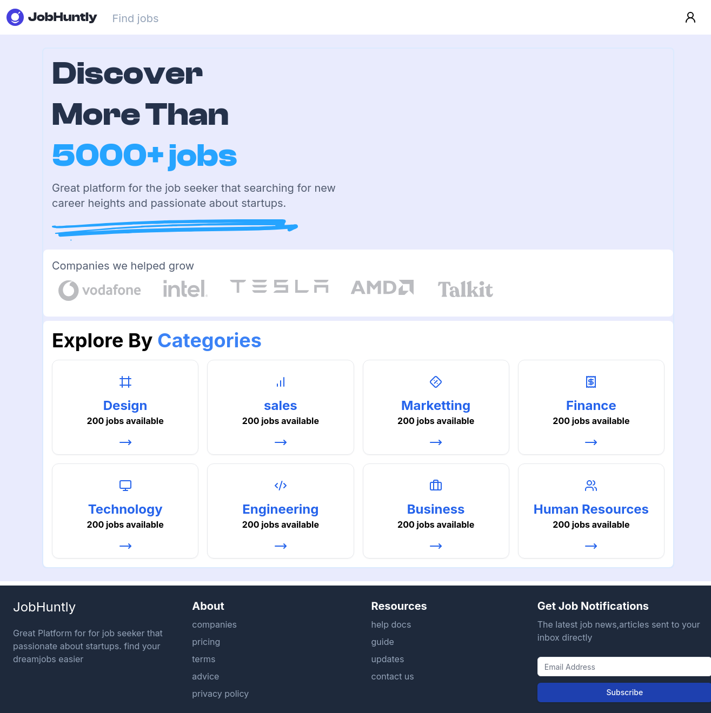

# Job Board - Full-Stack Application

A full-stack job board application built with **Next.js**, **React**, and **NestJS**. This project features user authentication, role-based access control, job search, and application management. It demonstrates proficiency in modern web development, scalable architecture, and responsive design.

---

## 🚀 Getting Started

To get started with the project, follow these steps:

### Prerequisites
- Node.js (v18 or higher)
- PostgreSQL
- PNPM (recommended)
- AWS S3 (for file uploads)

### Installation
1. Clone the repository:
   ```bash
   git clone https://github.com/saicharanars/jobboard
   cd jobboard
   ```

2. Install dependencies:
   ```bash
   pnpm install
   ```

3. Set up environment variables:
   - Create a `.env` file in the root directory.
   - Add the required environment variables (e.g., database credentials, JWT secret, AWS S3 keys).


4. Start the development server:
   ```bash
   pnpm run dev
   ```

5. Open your browser and navigate to `http://localhost:3000`.

---

## 🛠️ Technologies Used

### Frontend
- **Next.js**: For server-side rendering and routing.
- **React**: For building the user interface.
- **TypeScript**: For type safety and better developer experience.
- **Tailwind CSS**: For responsive and modern styling.
- **Shadcn UI**: For reusable and accessible UI components.
- **Redux Toolkit**: For state management.
- **RTK Query**: For efficient API interactions.
- **Tanstack Table**: For advanced data display and manipulation.

### Backend
- **NestJS**: For building a scalable and maintainable backend.
- **TypeORM**: For database management.
- **PostgreSQL**: As the primary database.
- **JWT**: For secure authentication and authorization.
- **Swagger**: For API documentation.

### Other Tools
- **AWS S3**: For file uploads (resumes, avatars).
- **PNPM**: For package management.
- **Nx**: For monorepo management and scalability.

---

## ✨ Key Features

### User Authentication
- Secure authentication using **JWT**.
- **Google OAuth** integration for seamless login.

### Role-Based Access Control
- Different views and functionalities for **job seekers** and **employers**.

### Job Management
- Employers can post and manage job listings.
- Job seekers can search, filter, and apply for jobs.

### Profile Management
- Job seekers and employers can manage their profiles.
- File uploads for resumes and avatars using **AWS S3**.

### Dashboard
- Data visualization for application status and statistics.
- Pagination for handling large datasets efficiently.

---

## 📂 Project Structure

The project follows a **monorepo structure** using **PNPM workspaces** and **Nx** for improved code sharing and scalability.

```
jobboard/
├── apps/
│   ├── web/       # Next.js application
│   └── api/        # NestJS application

```

---

## 📄 API Documentation

The backend API is documented using **Swagger UI**. To access the API documentation:

1. Start the backend server.
2. Navigate to `http://localhost:3000/api` in your browser.

---

## 🤝 Contributing

We welcome contributions! If you'd like to contribute, please follow these steps:

1. Fork the repository.
2. Create a new branch:
   ```bash
   git checkout -b feature/your-feature-name
   ```
3. Commit your changes:
   ```bash
   git commit -m "Add your message here"
   ```
4. Push to the branch:
   ```bash
   git push origin feature/your-feature-name
   ```
5. Open a pull request.

---

## 📜 License

This project is licensed under the MIT License. See the [LICENSE](LICENSE) file for details.

---

## 🙏 Acknowledgments

- Special thanks to the open-source community for providing amazing tools and libraries.
- Inspired by modern job board platforms.

---

## 📈 Project Status

This project is actively maintained. If you encounter any issues or have suggestions, feel free to open an issue or contribute!

---

## 💡 Skills Demonstrated

- **Frontend**: Next.js, React, TypeScript, Tailwind CSS, Shadcn UI, Redux Toolkit, Tanstack Table.
- **Backend**: NestJS, TypeORM, PostgreSQL, JWT, Swagger.
- **DevOps**: AWS S3, CI/CD, Monorepo management with PNPM and Nx.
- **General**: JavaScript, Node.js, TypeScript, HTML, CSS.

---

## 💡 Screenshots




Developed with ❤️ by Sai Charan Arishanapally 
